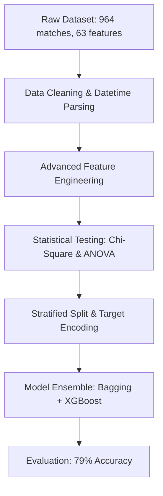

# 🏆 FIFA World Cup 2026 Prediction & Analysis

A machine learning pipeline designed to predict FIFA World Cup match outcomes—**Home Win**, **Away Win**, or **Draw**—by leveraging historical match data, team squad valuations, FIFA rankings, and ELO ratings. 

The project applies robust statistical testing for feature selection, implements advanced feature engineering, and utilizes a **Bagging XGBoost Ensemble** model to achieve an overall test accuracy of **79%**.

---

## 📊 Project Workflow Overview

The predictive pipeline is built in `Notebook/preprocessing.ipynb` and follows a standard structured machine learning workflow:



---

## 🛠️ Feature Engineering & Preprocessing

Starting with 63 raw columns, the project cleans the data and engineers domain-specific features that capture team strength, momentum, and historical matchups:

1. **Datetime Processing**:
   - Extracted `match_day`, `match_month`, and `match_year` from raw Match Dates.
   - Derived `start_time` (expressed as decimal hours, e.g., `14.5` for 2:30 PM) from Match Times.
2. **Team Strength & Value Ratios**:
   - `Rank Ratio`: $\frac{\text{Away Team FIFA Rank}}{\text{Home Team FIFA Rank}}$ (Since lower rank numbers indicate better teams, a ratio $> 1$ indicates a home team rank advantage).
   - `Squad Value Ratio`: $\frac{\text{Home Team Squad Value (€M)}}{\text{Away Team Squad Value (€M)}}$.
   - `elo difference`: $\text{Home Elo} - \text{Away Elo}$.
   - `Rank difference`: $\text{Home Team FIFA Rank} - \text{Away Team FIFA Rank}$.
   - `Team value difference`: $\text{Home Team Squad Value} - \text{Away Team Squad Value}$.
3. **Goal Statistics**:
   - `Home GD avg` / `Away GD avg`: Historical average goal differences ($\text{Goals Scored} - \text{Goals Conceded}$) for both teams.
4. **Historical Head-to-Head (H2H)**:
   - `H2H Total`: Total historical matches played between the two teams.
   - `H2H Home Win Rate` / `H2H Away Win Rate`: Calculated as $\frac{\text{H2H Wins}}{\text{H2H Total} + 1}$ (to prevent division by zero).
5. **Team Momentum**:
   - `win percent difference`: The difference between the home and away team win percentages in recent games.
6. **Heuristic Advantages**:
   - `Home Team advantage` / `Away Team Advantage`: Custom score representing cumulative advantages across FIFA rank, squad value, average goal difference, and Elo rating.

---

## 🔬 Statistical Testing & Encoding

To ensure the model learns from truly predictive features and doesn't overfit, statistical validation is performed:

- **Chi-Square Contingency Test**: Used to assess the relationship between categorical features (`Stage Name`, `Home Team Name`, `Away Team Name`) and the target outcome (`Result`). All were found to have highly significant relationships ($p < 0.05$).
- **Ordinal Mapping**:
  - `Stage Name` is mapped to sequential integers representing tournament progression:
    - Group Stages $\rightarrow$ `0`
    - Round of 32 $\rightarrow$ `1`
    - Round of 16 $\rightarrow$ `2`
    - Quarter-finals $\rightarrow$ `3`
    - Semi-finals / Third-place match $\rightarrow$ `4`
    - Finals / Final Round $\rightarrow$ `5`
- **Target Encoding**:
  - Applied `TargetEncoder` (with 5-fold cross-validation and smoothing) on high-cardinality nominal variables like `Home Team Name` and `Away Team Name` to convert them into informative continuous features without exploding the dimensionality.

---

## 🤖 Modeling & Ensemble Architecture

The model uses a stratified 80/20 train-test split to maintain class distributions, mapping the target outcomes:
* `0` $\rightarrow$ **Draw**
* `1` $\rightarrow$ **Away Team Win**
* `2` $\rightarrow$ **Home Team Win**

### Model Configuration:
- **Base Classifier**: `XGBClassifier`
  - Max Depth: `6`
  - Learning Rate: `0.01`
  - Estimators: `300`
  - Subsample & Colsample By Tree: `0.8`
- **Ensemble Wrapper**: `BaggingClassifier`
  - Wraps the XGBoost classifier.
  - Number of estimators: `10`
  - Increases generalizability and prevents overfitting.

---

## 📈 Performance Results

On the test dataset (193 matches), the model achieves an overall accuracy of **79.27%**.

### Classification Report

| Class | Outcome | Precision | Recall | F1-Score | Support |
| :---: | :---: | :---: | :---: | :---: | :---: |
| **0** | Draw | 0.64 | 0.25 | 0.36 | 36 |
| **1** | Away Team Win | 0.82 | 0.83 | 0.82 | 48 |
| **2** | Home Team Win | 0.79 | 0.94 | 0.86 | 109 |
| **Accuracy** | | | | **0.79** | **193** |
| **Macro Avg** | | 0.75 | 0.68 | 0.68 | 193 |
| **Weighted Avg** | | 0.77 | 0.79 | 0.76 | 193 |

### Confusion Matrix

$$\begin{pmatrix} 
9 & 5 & 22 \\ 
3 & 40 & 5 \\ 
2 & 4 & 103 
\end{pmatrix}$$

* **Key Takeaway**: The model is highly accurate at predicting home and away wins (with F1-scores of 0.86 and 0.82 respectively). Predicting draws remains the most challenging class (Recall of 0.25), which aligns with the unpredictable nature of draws in international football matches.

---

## 📁 Project Structure

```
├── Dataset/
│   └── dataset.csv           # Historical FIFA World Cup match data with engineered features
├── Model/
│   └── fifa_pred_model.pkl   # Trained Bagging XGBoost Ensemble model (saved classifier)
├── Notebook/
│   └── preprocessing.ipynb   # Jupyter Notebook for preprocessing, EDA, statistical testing, and model training
└── README.md                 # Project documentation (this file)
```

## 🚀 Getting Started

### Prerequisites
Install the required packages (including `joblib` to load the trained model):
```bash
pip install numpy pandas scikit-learn xgboost imbalanced-learn matplotlib seaborn joblib
```

### Run the Analysis
Open `Notebook/preprocessing.ipynb` in your Jupyter environment and run the cells sequentially to reproduce the preprocessing, feature engineering, and model training steps.

### Load and Use the Trained Model
The trained ensemble model is saved in the `Model/` directory. You can load it in Python using `joblib` to make predictions:
```python
import joblib

# Load the trained model
model = joblib.load("Model/fifa_pred_model.pkl")

# Predict match outcomes (0 = Draw, 1 = Away Team Win, 2 = Home Team Win)
# predictions = model.predict(new_features)
```